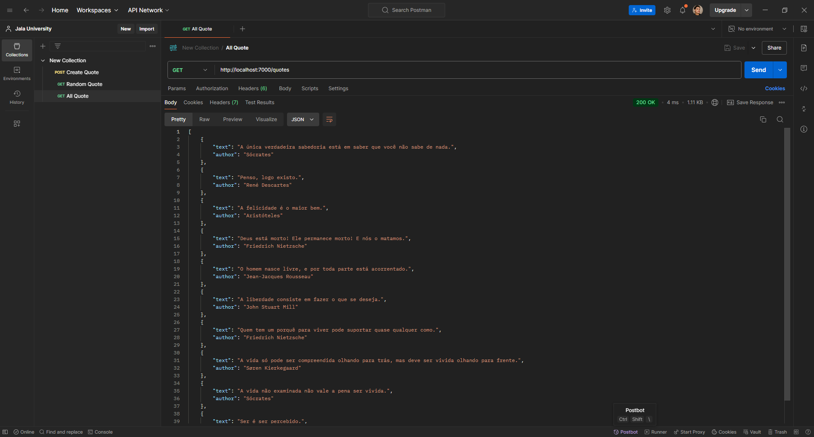
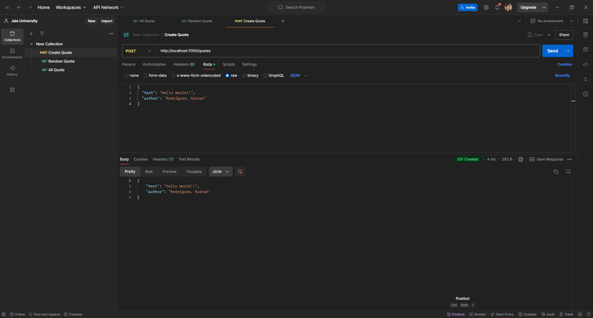
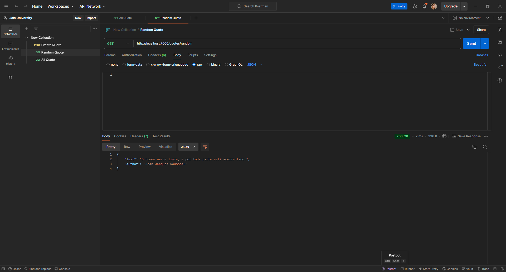

# Quotes KNX

Este projeto é uma aplicação simples que permite criar e visualizar citações usando uma estrutura baseada na **Arquitetura Limpa**.

## O que é Arquitetura Limpa?

A **Arquitetura Limpa** organiza o código em camadas separadas, cada uma com sua função bem definida. Isso facilita a manutenção do código, deixa o sistema mais fácil de entender e de adicionar novas funcionalidades. Aqui estão as camadas usadas neste projeto:

1. **Domínio (Regras de Negócio):** Aqui ficam as regras e o que o sistema deve fazer, como criar ou buscar citações.
2. **Aplicação:** São os casos de uso, como quando o sistema recebe uma solicitação para adicionar ou mostrar uma citação.
3. **Infraestrutura:** Lida com detalhes técnicos, como o banco de dados que armazena as citações (neste caso, um banco na memória).
4. **Apresentação:** É a parte que os usuários ou sistemas externos interagem, como os endpoints da API.

### Benefícios

- **Separação de responsabilidades**: Cada parte faz algo específico, o que facilita a manutenção.
- **Facilidade de mudança**: Se precisar trocar a forma como os dados são armazenados ou o framework usado, não precisamos mexer nas regras do sistema.
- **Testes mais fáceis**: Cada camada pode ser testada separadamente.

## Funcionalidades

O sistema tem as seguintes funções principais:

1. **Listar todas as citações:**

   - Mostra todas as citações já adicionadas ao sistema.
   - Abaixo uma imagem do postman acessando a rota e mostrando todas as citações:

   

2. **Criar uma nova citação:**

   - Permite adicionar uma nova citação e o nome do autor.
   - Abaixo está uma imagem como exemplo de requisição e resposta para criar uma citação:

   

3. **Buscar uma citação aleatória:**

   - Retorna uma citação aleatória da base de dados.
   - A imagem abaixo mostra uma citação aleatória sendo retornada:

   

## Como rodar o sistema

1. **Clonar o repositório**:

   ```bash
   git clone https://github.com/Kainanars/quotes-knx.git
   cd quotes-knx
   ```

2. **Instalar as dependências**:

   ```bash
   npm install
   ```

3. **Rodar o servidor**:

   ```bash
   npm start
   ```

4. A aplicação estará disponível em [http://localhost:7000](http://localhost:7000).

### Tecnologias usadas

- **Node.js** com Express para a API.
- Banco de dados em memória para armazenar as citações durante a execução.

### Execução no Postman

- Crie uma coleção com uma requisição com body:
  POST http://localhost:7000/quotes

```json
{
  "text": "{{quote_text}}",
  "author": "{{quote_author}}"
}
```

- Clique em Run Collection e selecione o arquivo [quotes.csv](./public/quotes.csv)
- O Postman vai adicionar todas as citações presentes no arquivo.
